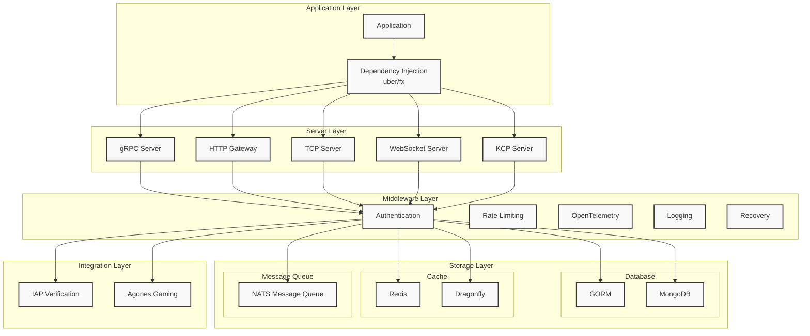

# moke-kit

[](https://goreportcard.com/report/github.com/gstones/moke-kit)
[](https://pkg.go.dev/github.com/GStones/moke-kit)
[](https://github.com/GStones/moke-kit)

#### English | [中文](./README_CN.md)

## What is moke-kit?

moke-kit is a toolkit for building microservices or monolithic applications in Go. You can develop your application as a monolithic service and deploy it as microservices. Like building with LEGO, you can assemble your services exactly how you want them.

## Diagram


## Features

* **Dependency Injection**: Uses [uber/fx](https://github.com/uber-go/fx) for inversion of control
* **Security**: 
  * Built-in TLS and mTLS support for [Zero Trust security](https://www.wikiwand.com/en/Zero_trust_security_model)
  * Built-in [Token-based authentication](https://www.okta.com/identity-101/what-is-token-based-authentication/) with JWT support
* **Built-in Middleware**: Rate limiting, OpenTelemetry, authentication, logging, panic recovery, and more
* **Caching**: 
  * Built-in [Cache-Aside pattern](https://learn.microsoft.com/en-us/azure/architecture/patterns/cache-aside) for ORM and NoSQL
  * Built-in [Compare-and-swap](https://www.wikiwand.com/en/Compare-and-swap) for database consistency
* **Development Tools**:
  * Command-line client for independent testing
  * Single command generation of proto, gRPC, gateway, Swagger, and client code using [buf](https://buf.build/)

## Built-in Kits

* [Servers](https://github.com/GStones/moke-kit/tree/main/server):
  * [gRPC](https://grpc.io/)
  * HTTP with [grpc-gateway](https://github.com/grpc-ecosystem/grpc-gateway)
  * TCP via [zinx](https://github.com/aceld/zinx)
  * WebSocket via [zinx](https://github.com/aceld/zinx)
  * KCP via [zinx](https://github.com/aceld/zinx)
* [Message Queue](https://github.com/GStones/moke-kit/tree/main/mq):
  * [NATS](https://nats.io/)
* [ORM](https://github.com/GStones/moke-kit/tree/main/orm):
  * [GORM](https://gorm.io/)
  * [MongoDB](https://github.com/mongodb/mongo-go-driver)
* [Cache](https://github.com/GStones/moke-kit/tree/main/orm/nosql/cache):
  * Redis
  * [Dragonfly](https://github.com/dragonflydb/dragonfly)
* [Third Party Integrations](https://github.com/GStones/moke-kit/tree/main/3rd):
  * [IAP](https://github.com/awa/go-iap) - Purchase receipt verification for AppStore, GooglePlayStore, and Amazon AppStore
  * [Agones](https://agones.dev/site/) - Game server hosting and scaling on Kubernetes

## Getting Started

1. Install gonew:
```bash
go install golang.org/x/tools/cmd/gonew@latest
```

2. Create a new project:
```bash
gonew github.com/gstones/moke-layout your.domain/myprog
```


## Layers

