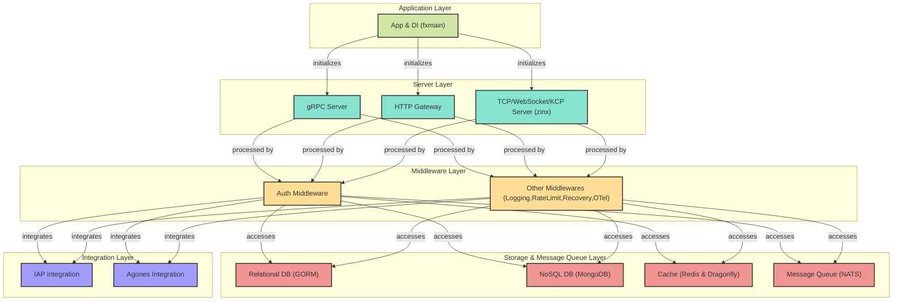

# moke-kit

[](https://goreportcard.com/report/github.com/gstones/moke-kit)
[](https://pkg.go.dev/github.com/GStones/moke-kit)
[](https://github.com/GStones/moke-kit)

#### English | [中文](./README_CN.md)

## What is moke-kit?

moke-kit is a toolkit for building microservices or monolithic applications in Go. You can develop your application as a monolithic service and deploy it as microservices. Like building with LEGO, you can assemble your services exactly how you want them.

## Ecosystem

```text
moke-kit (+ create-game skill)   → infra modules + scaffold a game repo directly
        ↓
your game binary                 → fxmain.Main composes kit (+ optional platform) modules
        ↓ optional
moke-game/platform               → shared services (auth, profile, mail, …) as fx modules
```

| Repo | Role |
| --- | --- |
| [moke-kit](https://github.com/GStones/moke-kit) | LEGO bricks: DI, servers, storage, MQ, integrations |
| [moke-game/game](https://github.com/moke-game/game) | Reference game (`game0`) with platform composition |
| [moke-game/platform](https://github.com/moke-game/platform) | Shared platform services imported into games |

New games should be created with the [`create-game`](./.cursor/skills/create-game/SKILL.md) skill / `scaffold.sh` in this repo.

See [COMPATIBILITY.md](./COMPATIBILITY.md) for validated version sets across kit / platform / game.

## Diagram

```mermaid
flowchart TD
%% Application Layer
  subgraph "Application Layer"
    app["App & DI (fxmain)"]:::app
  end

%% Server Layer
  subgraph "Server Layer"
    grpc["gRPC Server"]:::server
    gateway["HTTP Gateway"]:::server
    zinx["TCP/WebSocket/KCP Server (zinx)"]:::server
  end

%% Middleware Layer
  subgraph "Middleware Layer"
    auth["Auth Middleware"]:::mw
    stdmw["Other Middlewares (Logging,RateLimit,Recovery,OTel)"]:::mw
  end

%% Storage & Message Queue Layer
  subgraph "Storage & Message Queue Layer"
    gorm["Relational DB (GORM)"]:::storage
    mongo["NoSQL DB (MongoDB)"]:::storage
    cache["Cache (Redis & Dragonfly)"]:::storage
    nats["Message Queue (NATS)"]:::storage
  end

%% Integration Layer
  subgraph "Integration Layer"
    iap["IAP Integration"]:::integration
    agones["Agones Integration"]:::integration
  end

%% Connections from Application Layer to Server Layer 
  app -->|"initializes"| grpc
  app -->|"initializes"| gateway
  app -->|"initializes"| zinx

%% Connections from Server Layer to Middleware Layer
  grpc -->|"processed by"| auth
  grpc -->|"processed by"| stdmw
  gateway -->|"processed by"| auth
  gateway -->|"processed by"| stdmw
  zinx -->|"processed by"| auth
  zinx -->|"processed by"| stdmw

%% Connections from Middleware Layer to Storage & Message Queue Layer
  auth -->|"accesses"| gorm
  auth -->|"accesses"| mongo
  auth -->|"accesses"| cache
  auth -->|"accesses"| nats
  stdmw -->|"accesses"| gorm
  stdmw -->|"accesses"| mongo
  stdmw -->|"accesses"| cache
  stdmw -->|"accesses"| nats

%% Connections from Middleware Layer to Integration Layer
  auth -->|"integrates"| iap
  auth -->|"integrates"| agones
  stdmw -->|"integrates"| iap
  stdmw -->|"integrates"| agones

%% Styles
  classDef app fill:#D0E6A5,stroke:#333,stroke-width:2px;
  classDef server fill:#86E3CE,stroke:#333,stroke-width:2px;
  classDef mw fill:#FFDD94,stroke:#333,stroke-width:2px;
  classDef storage fill:#F09494,stroke:#333,stroke-width:2px;
  classDef integration fill:#A29BFE,stroke:#333,stroke-width:2px;

%% Click Events
  click app "https://github.com/gstones/moke-kit/blob/main/fxmain/fxmain.go"
  click grpc "https://github.com/gstones/moke-kit/blob/main/server/internal/srpc/grpc.go"
  click gateway "https://github.com/gstones/moke-kit/blob/main/server/internal/srpc/gateway.go"
  click zinx "https://github.com/gstones/moke-kit/blob/main/server/internal/zinx/zinx_tcp.go"
  click auth "https://github.com/gstones/moke-kit/blob/main/3rd/auth/pkg/authfx/firebase_middleware.go"
  click stdmw "https://github.com/gstones/moke-kit/blob/main/server/middlewares/logger.go"
  click gorm "https://github.com/gstones/moke-kit/blob/main/orm/pkg/ofx/gorm_module.go"
  click mongo "https://github.com/gstones/moke-kit/blob/main/orm/nosql/mongo/factory.go"
  click cache "https://github.com/gstones/moke-kit/blob/main/orm/nosql/cache/redis_cache.go"
  click nats "https://github.com/gstones/moke-kit/blob/main/mq/internal/nats/message_queue.go"
  click iap "https://github.com/gstones/moke-kit/blob/main/3rd/iap/pkg/iapfx/iap_clients.go"
  click agones "https://github.com/gstones/moke-kit/tree/main/3rd/agones/pkg/agonesfx"
```

## Features

* **Dependency Injection**: Uses [uber/fx](https://github.com/uber-go/fx) for inversion of control
* **Security**: 
  * Built-in TLS and mTLS support for [Zero Trust security](https://www.wikiwand.com/en/Zero_trust_security_model)
  * Built-in [Token-based authentication](https://www.okta.com/identity-101/what-is-token-based-authentication/) with JWT support
  * Production startup fails closed when gRPC or gateway services are exposed without auth middleware
  * Gateway CORS allowlists are configured explicitly with `CORS_ALLOW_ORIGINS` in production
  * Reference architecture: [moke-game/platform](https://github.com/moke-game/platform) and [moke-game/game](https://github.com/moke-game/game)
* **Built-in Middleware**: Rate limiting, OpenTelemetry, authentication, logging, panic recovery, and more
* **Caching**: 
  * Built-in [Cache-Aside pattern](https://learn.microsoft.com/en-us/azure/architecture/patterns/cache-aside) for ORM and NoSQL
  * Built-in [Compare-and-swap](https://www.wikiwand.com/en/Compare-and-swap) for database consistency
* **Development Tools**:
  * Command-line client for independent testing
  * Single command generation of proto, gRPC, gateway, Swagger, and client code using [buf](https://buf.build/)

## Repository layout

| Path | Package |
| --- | --- |
| [`fxmain/`](./fxmain) | App entry: `fxmain.Main(...)` + `AppModule` |
| [`server/`](./server) | gRPC, grpc-gateway, zinx (TCP/WS/KCP), middleware, TLS/mTLS |
| [`orm/`](./orm) | Mongo document store, Redis/Dragonfly, GORM |
| [`mq/`](./mq) | NATS and local in-process message queue |
| [`logging/`](./logging) | Logging modules |
| [`utility/`](./utility) | Config helpers, deployment helpers, auth opt-out |
| [`3rd/`](./3rd) | Auth, IAP, Agones, cloud integrations |
| [`test/`](./test) | Kit-level tests |

## Built-in Kits

* [Servers](https://github.com/GStones/moke-kit/tree/main/server):
  * [gRPC](https://grpc.io/)
  * HTTP with [grpc-gateway](https://github.com/grpc-ecosystem/grpc-gateway)
  * TCP via [zinx](https://github.com/aceld/zinx)
  * WebSocket via [zinx](https://github.com/aceld/zinx)
  * KCP via [zinx](https://github.com/aceld/zinx)
* [Message Queue](https://github.com/GStones/moke-kit/tree/main/mq):
  * [NATS](https://nats.io/)
* [ORM](https://github.com/GStones/moke-kit/tree/main/orm):
  * [GORM](https://gorm.io/)
  * [MongoDB](https://github.com/mongodb/mongo-go-driver)
* [Cache](https://github.com/GStones/moke-kit/tree/main/orm/nosql/cache):
  * Redis
  * [Dragonfly](https://github.com/dragonflydb/dragonfly)
* [Third Party Integrations](https://github.com/GStones/moke-kit/tree/main/3rd):
  * [IAP](https://github.com/awa/go-iap) - Purchase receipt verification for AppStore, GooglePlayStore, and Amazon AppStore
  * [Agones](https://agones.dev/site/) - Game server hosting and scaling on Kubernetes

## Getting Started

Requirements: Go version from [`go.mod`](./go.mod), [Docker](https://docs.docker.com/get-docker/) (for local infra), [buf](https://buf.build/docs/installation) (for protobuf).

### 1. Scaffold a game with the create-game skill

Create a new game **directly from this repo’s templates** (no `gonew` / `moke-layout`):

```bash
# from the moke-kit repository root
chmod +x .cursor/skills/create-game/scripts/scaffold.sh

.cursor/skills/create-game/scripts/scaffold.sh \
  --module github.com/<org>/<game> \
  --name <name> \
  --out ./<name>
```

This writes a full game repo (proto, `fxmain` entrypoint, domain/DAO, client CLI, docker-compose), runs `go mod tidy`, and `buf generate` when `buf` is available.

In Cursor, you can also run `/create-game` or ask “create a game based on moke-kit”.

Reference games that compose [platform](https://github.com/moke-game/platform) modules: [moke-game/game](https://github.com/moke-game/game).

### 2. Start local infrastructure

```bash
cd <name>
docker compose -f ./deployment/docker-compose/infrastructure.yaml up -d
```

Typical defaults (override with env vars):

| ENV | Default |
| --- | --- |
| `PORT` | `8081` |
| `ZINX_TCP_PORT` | `8888` |
| `DATABASE_URL` | `mongodb://localhost:27017` |
| `CACHE_URL` | `redis://localhost:6379` |
| `NATS_URL` | `nats://localhost:4222` |
| `DEPLOYMENT` | `local` |

### 3. Run the service

```bash
go run ./cmd/<name>/service/main.go
```

Smoke test with the interactive client:

```bash
go build -o <name> ./cmd/<name>/client/main.go
./<name> grpc   # or: tcp — HTTP via Postman on localhost:8081
```

### 4. Compose modules in `fxmain.Main`

`fxmain.Main` always loads `AppModule` (server, orm, logging, mq settings) and binds registered services. Pass only the extra modules you need:

```go
fxmain.Main(
    // infra beyond AppModule
    mfx.NatsModule,
    mfx.LocalModule,
    ofx.RedisCacheModule,

    // your game modules (GrpcModule / HttpModule / TcpModule / AllModule)
    modules.AllModule,

    // optional shared platform services
    // auth.AuthAllModule,
    // profile.ProfileModule,
)
```

Register game handlers by implementing `siface.IGrpcService` / `IGatewayService` / `IZinxService` and providing `sfx.GrpcServiceResult` / `GatewayServiceResult` / `ZinxServiceResult`.

## Cursor Agent Skills

Project skills under [`.cursor/skills/`](./.cursor/skills) help agents scaffold and extend games on this kit:

| Skill | Use when |
| --- | --- |
| [`create-game`](./.cursor/skills/create-game/SKILL.md) | Scaffold a new game from built-in templates (`scaffold.sh`) |
| [`add-game-rpc`](./.cursor/skills/add-game-rpc/SKILL.md) | Add a protobuf RPC and wire gRPC / gateway / zinx |
| [`compose-moke-modules`](./.cursor/skills/compose-moke-modules/SKILL.md) | Assemble moke-kit + platform modules in `fxmain.Main` |

In Cursor, invoke with `/create-game` (or ask in natural language, e.g. “create a game based on moke-kit”).

## Develop moke-kit itself

```bash
go test -race ./...
go vet ./...
gofmt -s -w .
```

CI also runs `staticcheck` via reviewdog on pull requests.

## License

See [LICENSE](./LICENSE).
