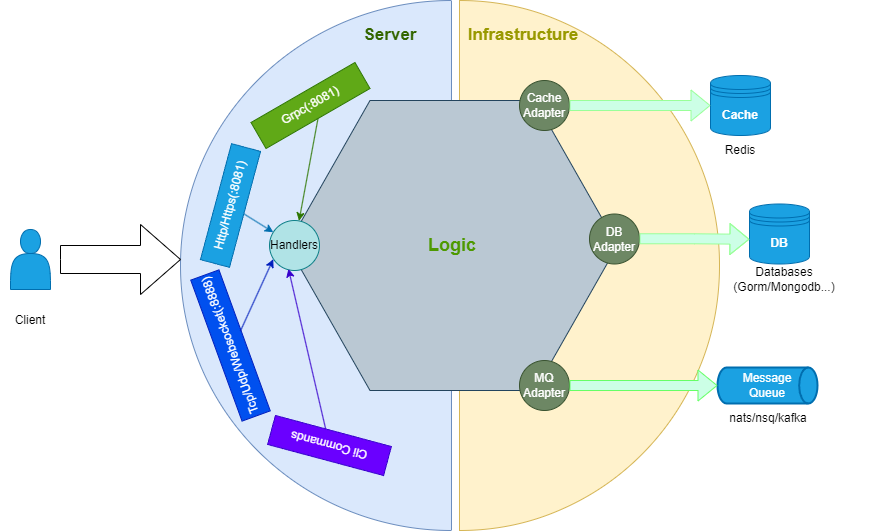

# moke-kit

[](https://goreportcard.com/report/github.com/gstones/moke-kit)
[](https://pkg.go.dev/github.com/GStones/moke-kit)
[](https://github.com/GStones/moke-kit)

#### [English](./README.md) | 中文

## 什么是 moke-kit?

moke-kit 是一个用于构建微服务/单体应用的基础框架。可以按照单体应用开发，生产环境部署为微服务模式。像玩LEGO积木一样，你可以按需灵活拼接不同类型的服务。

## 架构



## 特性

* 使用 [uber/fx](https://github.com/uber-go/fx) 实现IOC(依赖注入控制反转)，可以按需组装不同类型服务。
* 内置TLS，mTLS，快速构建[Zero Trust安全模型](https://www.wikiwand.com/en/Zero_trust_security_model)。
* 内置[基于Token的认证](https://www.okta.com/identity-101/what-is-token-based-authentication/)，支持JWT token。
* 内置中间件(rate limit, open telemetry, auth middleware,logging, panic recovery等)。
* 内置[Cache-Aside模式](https://learn.microsoft.com/en-us/azure/architecture/patterns/cache-aside)数据缓存机制。
* 内置[Compare-and-swap](https://www.wikiwand.com/en/Compare-and-swap)保证数据库操作的一致性。
* 内置交互式命令行客户端，方便独立测试服务接口。
* 基于[buf](https://buf.build/)一键生成proto, grpc, gateway, swagger和客户端的协议文件。

## 内置组件

* [Servers](https://github.com/GStones/moke-kit/tree/main/server):
    * [gRPC](https://grpc.io/)
    * HTTP[[grpc-gateway](https://github.com/grpc-ecosystem/grpc-gateway)]
    * TCP [[zinx](https://github.com/aceld/zinx)]
    * Websocket [[zinx](https://github.com/aceld/zinx)]
    * KCP [[zinx](https://github.com/aceld/zinx)]
* [MQ](https://github.com/GStones/moke-kit/tree/main/mq):
    * [nats](https://nats.io/)
* [Orm](https://github.com/GStones/moke-kit/tree/main/orm):
    * [gorm](https://gorm.io/)
    * [mongodb](https://github.com/mongodb/mongo-go-driver)
* [Cache](https://github.com/GStones/moke-kit/tree/main/orm/nosql/cache):
    * redis
    * [dragonfly](https://github.com/dragonflydb/dragonfly)
* [Third Party](https://github.com/GStones/moke-kit/tree/main/3rd):
    * [IAP](https://github.com/awa/go-iap): 验证AppStore, GooglePlayStore或Amazon AppStore的购买凭证。
    * [Agones](https://agones.dev/site/):  在Kubernetes上托管、运行和扩展DedicatedServer游戏服务器。

## 快速开始

* 安装 gonew:

 ``` bash 
    go install golang.org/x/tools/cmd/gonew@latest
 ```

* 创建自己的项目:

 ``` bash 
    gonew github.com/gstones/moke-layout your.domain/myprog
 ```
    


