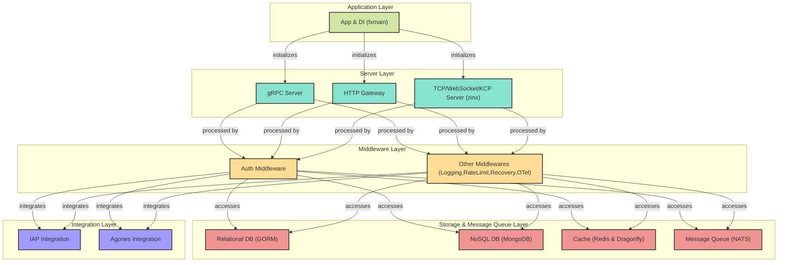

# moke-kit

[](https://goreportcard.com/report/github.com/gstones/moke-kit)
[](https://pkg.go.dev/github.com/GStones/moke-kit)
[](https://github.com/GStones/moke-kit)

#### [English](./README.md) | 中文

## 什么是 moke-kit?

moke-kit 是一个用于构建微服务/单体应用的基础框架。可以按照单体应用开发，生产环境部署为微服务模式。像玩 LEGO 积木一样，你可以按需灵活搭建不同类型的服务。

## 生态

```text
moke-kit（+ create-game Skill）  → 基础设施模块 + 直接脚手架生成游戏仓库
        ↓
你的游戏二进制                   → fxmain.Main 组装 kit（+ 可选 platform）模块
        ↓ 可选
moke-game/platform               → 共享中台服务（auth、profile、mail 等），以 fx 模块形式引入
```

| 仓库 | 作用 |
| --- | --- |
| [moke-kit](https://github.com/GStones/moke-kit) | LEGO 积木：DI、服务器、存储、MQ、第三方集成 |
| [moke-game/game](https://github.com/moke-game/game) | 参考游戏（`game0`），已组合 platform 模块 |
| [moke-game/platform](https://github.com/moke-game/platform) | 可被游戏引入的共享中台服务 |

新游戏请用本仓库的 [`create-game`](./.cursor/skills/create-game/SKILL.md) Skill / `scaffold.sh` 直接生成。

版本兼容矩阵见 [COMPATIBILITY.md](./COMPATIBILITY.md)。

## 架构

```mermaid
flowchart TD
%% Application Layer
  subgraph "Application Layer"
    app["App & DI (fxmain)"]:::app
  end

%% Server Layer
  subgraph "Server Layer"
    grpc["gRPC Server"]:::server
    gateway["HTTP Gateway"]:::server
    zinx["TCP/WebSocket/KCP Server (zinx)"]:::server
  end

%% Middleware Layer
  subgraph "Middleware Layer"
    auth["Auth Middleware"]:::mw
    stdmw["Other Middlewares (Logging,RateLimit,Recovery,OTel)"]:::mw
  end

%% Storage & Message Queue Layer
  subgraph "Storage & Message Queue Layer"
    gorm["Relational DB (GORM)"]:::storage
    mongo["NoSQL DB (MongoDB)"]:::storage
    cache["Cache (Redis & Dragonfly)"]:::storage
    nats["Message Queue (NATS)"]:::storage
  end

%% Integration Layer
  subgraph "Integration Layer"
    iap["IAP Integration"]:::integration
    agones["Agones Integration"]:::integration
  end

%% Connections from Application Layer to Server Layer 
  app -->|"initializes"| grpc
  app -->|"initializes"| gateway
  app -->|"initializes"| zinx

%% Connections from Server Layer to Middleware Layer
  grpc -->|"processed by"| auth
  grpc -->|"processed by"| stdmw
  gateway -->|"processed by"| auth
  gateway -->|"processed by"| stdmw
  zinx -->|"processed by"| auth
  zinx -->|"processed by"| stdmw

%% Connections from Middleware Layer to Storage & Message Queue Layer
  auth -->|"accesses"| gorm
  auth -->|"accesses"| mongo
  auth -->|"accesses"| cache
  auth -->|"accesses"| nats
  stdmw -->|"accesses"| gorm
  stdmw -->|"accesses"| mongo
  stdmw -->|"accesses"| cache
  stdmw -->|"accesses"| nats

%% Connections from Middleware Layer to Integration Layer
  auth -->|"integrates"| iap
  auth -->|"integrates"| agones
  stdmw -->|"integrates"| iap
  stdmw -->|"integrates"| agones

%% Styles
  classDef app fill:#D0E6A5,stroke:#333,stroke-width:2px;
  classDef server fill:#86E3CE,stroke:#333,stroke-width:2px;
  classDef mw fill:#FFDD94,stroke:#333,stroke-width:2px;
  classDef storage fill:#F09494,stroke:#333,stroke-width:2px;
  classDef integration fill:#A29BFE,stroke:#333,stroke-width:2px;

%% Click Events
  click app "https://github.com/gstones/moke-kit/blob/main/fxmain/fxmain.go"
  click grpc "https://github.com/gstones/moke-kit/blob/main/server/internal/srpc/grpc.go"
  click gateway "https://github.com/gstones/moke-kit/blob/main/server/internal/srpc/gateway.go"
  click zinx "https://github.com/gstones/moke-kit/blob/main/server/internal/zinx/zinx_tcp.go"
  click auth "https://github.com/gstones/moke-kit/blob/main/3rd/auth/pkg/authfx/firebase_middleware.go"
  click stdmw "https://github.com/gstones/moke-kit/blob/main/server/middlewares/logger.go"
  click gorm "https://github.com/gstones/moke-kit/blob/main/orm/pkg/ofx/gorm_module.go"
  click mongo "https://github.com/gstones/moke-kit/blob/main/orm/nosql/mongo/factory.go"
  click cache "https://github.com/gstones/moke-kit/blob/main/orm/nosql/cache/redis_cache.go"
  click nats "https://github.com/gstones/moke-kit/blob/main/mq/internal/nats/message_queue.go"
  click iap "https://github.com/gstones/moke-kit/blob/main/3rd/iap/pkg/iapfx/iap_clients.go"
  click agones "https://github.com/gstones/moke-kit/tree/main/3rd/agones/pkg/agonesfx"
```

## 特性

* 使用 [uber/fx](https://github.com/uber-go/fx) 实现 IOC（依赖注入），可按需组装不同类型服务。
* 内置 TLS / mTLS，便于构建 [Zero Trust](https://www.wikiwand.com/en/Zero_trust_security_model) 安全模型。
* 内置 [Token 认证](https://www.okta.com/identity-101/what-is-token-based-authentication/)，支持 JWT。
* 生产环境在暴露 gRPC / gateway 且缺少 auth middleware 时 **fail closed**；CORS 通过 `CORS_ALLOW_ORIGINS` 显式配置。
* 内置中间件：限流、OpenTelemetry、认证、日志、panic recovery 等。
* 内置 [Cache-Aside](https://learn.microsoft.com/en-us/azure/architecture/patterns/cache-aside) 与 [CAS](https://www.wikiwand.com/en/Compare-and-swap) 一致性机制。
* 内置交互式命令行客户端；基于 [buf](https://buf.build/) 一键生成 proto / gRPC / gateway / Swagger。
* 参考实现：[moke-game/platform](https://github.com/moke-game/platform)、[moke-game/game](https://github.com/moke-game/game)。

## 仓库结构

| 路径 | 说明 |
| --- | --- |
| [`fxmain/`](./fxmain) | 应用入口：`fxmain.Main(...)` 与 `AppModule` |
| [`server/`](./server) | gRPC、grpc-gateway、zinx（TCP/WS/KCP）、中间件、TLS/mTLS |
| [`orm/`](./orm) | Mongo 文档库、Redis/Dragonfly、GORM |
| [`mq/`](./mq) | NATS 与进程内本地 MQ |
| [`logging/`](./logging) | 日志模块 |
| [`utility/`](./utility) | 配置、部署环境、认证豁免等工具 |
| [`3rd/`](./3rd) | Auth、IAP、Agones、云相关集成 |
| [`test/`](./test) | kit 级测试 |

## 内置组件

* [Servers](https://github.com/GStones/moke-kit/tree/main/server):
    * [gRPC](https://grpc.io/)
    * HTTP [[grpc-gateway](https://github.com/grpc-ecosystem/grpc-gateway)]
    * TCP [[zinx](https://github.com/aceld/zinx)]
    * Websocket [[zinx](https://github.com/aceld/zinx)]
    * KCP [[zinx](https://github.com/aceld/zinx)]
* [MQ](https://github.com/GStones/moke-kit/tree/main/mq):
    * [nats](https://nats.io/)
* [Orm](https://github.com/GStones/moke-kit/tree/main/orm):
    * [gorm](https://gorm.io/)
    * [mongodb](https://github.com/mongodb/mongo-go-driver)
* [Cache](https://github.com/GStones/moke-kit/tree/main/orm/nosql/cache):
    * redis
    * [dragonfly](https://github.com/dragonflydb/dragonfly)
* [Third Party](https://github.com/GStones/moke-kit/tree/main/3rd):
    * [IAP](https://github.com/awa/go-iap)：验证 AppStore / GooglePlay / Amazon 购买凭证
    * [Agones](https://agones.dev/site/)：在 Kubernetes 上托管与扩展 Dedicated Server

## 快速开始

依赖：[`go.mod`](./go.mod) 中的 Go 版本、[Docker](https://docs.docker.com/get-docker/)（本地基础设施）、[buf](https://buf.build/docs/installation)（protobuf）。

### 1. 用 create-game Skill 直接脚手架

**直接从本仓库模板生成游戏**（不使用 `gonew` / `moke-layout`）：

```bash
# 在 moke-kit 仓库根目录执行
chmod +x .cursor/skills/create-game/scripts/scaffold.sh

.cursor/skills/create-game/scripts/scaffold.sh \
  --module github.com/<org>/<game> \
  --name <name> \
  --out ./<name>
```

脚本会生成完整游戏仓库（proto、`fxmain` 入口、domain/DAO、客户端、docker-compose），并执行 `go mod tidy`；若已安装 `buf` 还会运行 `buf generate`。

在 Cursor 中也可执行 `/create-game`，或直接说「基于 moke-kit 创建一个 game」。

已组合 [platform](https://github.com/moke-game/platform) 的参考实现见 [moke-game/game](https://github.com/moke-game/game)。

### 2. 启动本地基础设施

```bash
cd <name>
docker compose -f ./deployment/docker-compose/infrastructure.yaml up -d
```

常用默认环境变量（可用 ENV 覆盖）：

| ENV | 默认值 |
| --- | --- |
| `PORT` | `8081` |
| `ZINX_TCP_PORT` | `8888` |
| `DATABASE_URL` | `mongodb://localhost:27017` |
| `CACHE_URL` | `redis://localhost:6379` |
| `NATS_URL` | `nats://localhost:4222` |
| `DEPLOYMENT` | `local` |

### 3. 运行服务

```bash
go run ./cmd/<name>/service/main.go
```

用交互式客户端做冒烟测试：

```bash
go build -o <name> ./cmd/<name>/client/main.go
./<name> grpc   # 或 tcp；HTTP 可用 Postman 访问 localhost:8081
```

### 4. 在 `fxmain.Main` 中组装模块

`fxmain.Main` 会加载 `AppModule`（server、orm、logging、mq settings）并绑定已注册服务。只需传入额外需要的模块：

```go
fxmain.Main(
    // AppModule 之外的基础设施
    mfx.NatsModule,
    mfx.LocalModule,
    ofx.RedisCacheModule,

    // 游戏模块（GrpcModule / HttpModule / TcpModule / AllModule）
    modules.AllModule,

    // 可选：中台共享服务
    // auth.AuthAllModule,
    // profile.ProfileModule,
)
```

游戏 handler 需实现 `siface.IGrpcService` / `IGatewayService` / `IZinxService`，并通过 `fx.Provide` 返回 `sfx.GrpcServiceResult` / `GatewayServiceResult` / `ZinxServiceResult`。

## Cursor Agent Skills

[`.cursor/skills/`](./.cursor/skills) 下的项目级 Skill，便于 Agent 基于本 kit 搭建与扩展游戏：

| Skill | 适用场景 |
| --- | --- |
| [`create-game`](./.cursor/skills/create-game/SKILL.md) | 用内置模板 / `scaffold.sh` 直接生成新游戏 |
| [`add-game-rpc`](./.cursor/skills/add-game-rpc/SKILL.md) | 新增 protobuf RPC，并接入 gRPC / gateway / zinx |
| [`compose-moke-modules`](./.cursor/skills/compose-moke-modules/SKILL.md) | 在 `fxmain.Main` 中组装 moke-kit 与 platform 模块 |

在 Cursor 中可用 `/create-game`，或直接说「基于 moke-kit 创建一个 game」。

## 开发 moke-kit 本身

```bash
go test -race ./...
go vet ./...
gofmt -s -w .
```

CI 会在 PR 上通过 reviewdog 运行 `staticcheck`。

## 许可证

见 [LICENSE](./LICENSE)。
